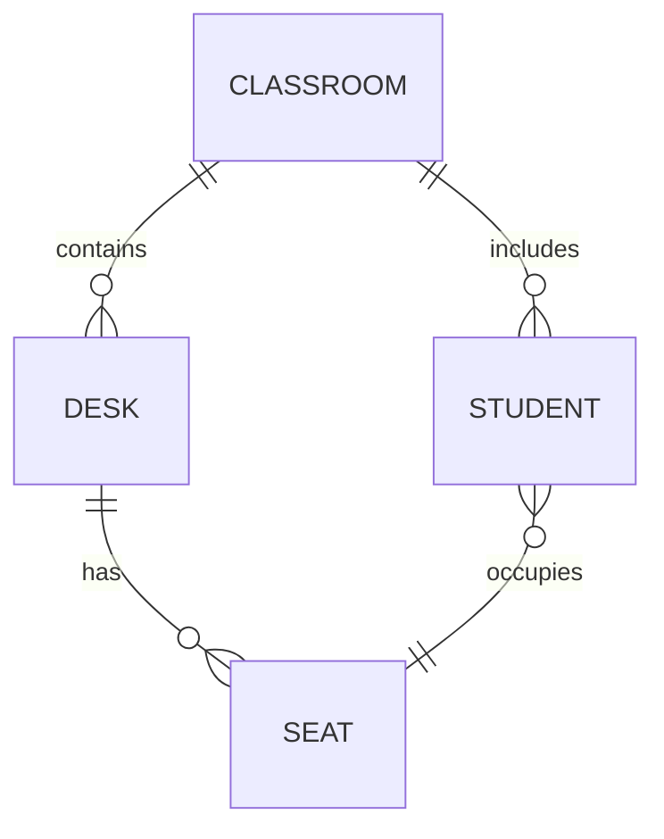

# Yêu cầu kỹ thuật ứng dụng web sắp xếp chỗ ngồi lớp học

## Tóm tắt
Đề án phát triển một ứng dụng web giúp giáo viên **tạo và quản lý sơ đồ chỗ ngồi** cho lớp học. Ứng dụng sẽ cho phép người dùng tạo thông tin lớp (số bàn, số hàng, số học sinh/bàn) và các thông số hướng của phòng (hướng bảng, hướng cửa sổ, hướng bàn giáo viên). Hệ thống cho phép nhập danh sách học sinh với các thuộc tính (tên, giới tính, cân nặng, chiều cao, học lực), sau đó hiển thị **mô hình 3D trực quan** của lớp với các bàn và vị trí ngồi. 

Người dùng có thể **tự động sắp xếp chỗ ngồi** theo nhiều tiêu chí (ví dụ: tên, học lực, phân bố giới tính, cân nặng/chiều cao, hoặc theo ưu tiên khác) hoặc thậm chí xây dựng bản đồ chỗ ngồi ngẫu nhiên ban đầu. Sau khi hệ thống gợi ý bản sắp xếp, giáo viên có thể **kéo thả** để điều chỉnh thủ công vị trí học sinh. Kết quả sơ đồ cuối cùng có thể được **xuất ra PDF** để in hoặc chia sẻ. 

Báo cáo này trình bày yêu cầu chức năng, thiết kế UI/UX, mô hình dữ liệu, thuật toán phân bổ, lựa chọn thư viện công nghệ (đặc biệt là 3D WebGL), kiến trúc hệ thống và kế hoạch triển khai. Mục tiêu là một thiết kế đầy đủ, chi tiết, dựa trên khảo sát các ứng dụng tương tự và các công nghệ phổ biến, đảm bảo dễ dùng, khả năng mở rộng và bảo mật.

## 1. Yêu cầu chức năng (Functional Requirements)

- **Tạo lớp học (Classroom creation)**: 
  - Người dùng thiết lập số **bàn** trong lớp, số **hàng/dãy** (rows) và số học sinh trên mỗi bàn (số chỗ ngồi). Ví dụ: 20 bàn, xếp thành 4 hàng, mỗi bàn 2 học sinh. 
  - Chọn **kiểu bố cục phòng**: dạng lưới (Grid), chữ U (U-Shape), nhóm đôi (Pairs) hoặc tùy chỉnh (ví dụ: bố trí cụm nhóm, hàng đơn). Như công cụ OpenEduCat gợi ý, có thể cung cấp lựa chọn layout kiểu "Grid, U-Shape, Pairs" để thiết kế sơ đồ ban đầu.
  - Thiết lập **hướng phòng**: định hướng bảng (ví dụ: phía Bắc), hướng của các cửa sổ hoặc cửa ra vào (nếu cần thiết mô hình hóa), hướng vị trí bàn giáo viên. Các chiều hướng này sẽ ảnh hưởng đến cách hiển thị sân khấu giảng và xoay mô hình 3D.

- **Nhập danh sách học sinh**:
  - Cho phép người dùng **import** danh sách học sinh từ CSV hoặc copy-paste từ bảng tính. Mỗi học sinh có các trường thông tin như: *Tên*, *Giới tính*, *Cân nặng*, *Chiều cao*, *Học lực/Điểm số* (có thể là số hoặc phân loại). Có thể cho phép thêm ảnh đại diện hay ghi chú (ví dụ: ghi chú về đặc biệt) cho học sinh.
  - Hiển thị danh sách học sinh ở bên (Sidebar) dưới dạng thẻ (cards) có thể **kéo-thả**. Ví dụ, ứng dụng SeatPlan.io cho phép “Paste names từ gradebook hoặc CSV… mỗi học sinh là một thẻ có thể kéo-thả vào bàn”. 

- **Mô hình 3D tương tác**:
  - Trình bày sơ đồ lớp dưới dạng **mô hình 3D**. Các bàn và ghế được hiển thị ở vị trí tương ứng trong phòng. Học sinh được gắn tên lên ghế. Cho phép người dùng xoay, phóng to/thu nhỏ cảnh xem 3D (orbit/pan/zoom camera). Có thể sử dụng camera phối cảnh (perspective) hoặc camera trực giao để đạt view isometric. Three.js cung cấp cả *OrthographicCamera* và *OrbitControls* để quay/scull3D scene.
  - Cần hỗ trợ **các đối tượng trang trí** tùy chọn: ví dụ bàn giáo viên, bảng, cửa sổ, cửa ra vào, chậu cây… Như ví dụ của SeatingChartMaker, “có thể thêm bàn giáo viên, cửa sổ và cây xanh, tùy chỉnh giao diện thẻ học sinh”. Hệ thống nên cho phép thêm/xóa các vật trang trí để phòng thêm sinh động.

- **Sắp xếp tự động (Auto-arrangement)**:
  - Cung cấp các tùy chọn **thuật toán gợi ý sắp xếp chỗ ngồi** dựa trên các tiêu chí: 
    - **Theo tên**: sắp xếp học sinh theo bảng chữ cái (từ điển theo tên hoặc họ). Ví dụ tính năng của SeatPlan.io cho phép sort danh sách theo tên hoặc họ.
    - **Theo học lực**: phân phối xen kẽ học sinh học lực cao - thấp, hoặc gom theo nhóm mạnh, yếu tùy yêu cầu.
    - **Theo giới tính**: tách riêng hoặc xen kẽ nam - nữ theo mong muốn.
    - **Theo kích thước/chiều cao**: ví dụ xếp học sinh thấp gần bảng, học sinh cao ra phía sau để không che khuất tầm nhìn.
    - **Theo ưu tiên đặc biệt**: như học sinh cần hỗ trợ (khuyết tật, thị lực) gần với giáo viên; hay tránh xếp cạnh nhau những học sinh hay quậy phá.
  - Thuật toán sắp xếp có thể hỗ trợ ngẫu nhiên ban đầu hoặc logic sơ bộ. Nhiều ứng dụng trên thị trường cho phép khởi tạo bản sắp xếp ngẫu nhiên hoặc theo thứ tự. Ví dụ **SeatingChartMaker** hỗ trợ tạo chỗ ngồi ngẫu nhiên (random seating), trong khi **SeatPlan.io** chỉ ra “kéo bàn, thả học sinh, in ấn PDF” như luồng chính. 

- **Kéo thả thủ công (Manual drag-and-drop)**:
  - Sau khi tự động sắp xếp, cho phép người dùng **kéo và đổi chỗ học sinh** trên mô hình 3D hoặc giao diện 2D. Chức năng kéo-thả phải linh động, tương tự OpenEduCat: “Click ghế để đánh dấu trống. Kéo tên học sinh để đổi vị trí”. 
  - Giao diện có thể minh họa trạng thái ghế: *Đã gán*, *Chưa gán*, *Chỗ trống* như OpenEduCat cho biết (Assigned, Unassigned, Empty) để giáo viên dễ quản lý.

- **Xuất PDF sơ đồ (Export PDF)**:
  - Sau khi hoàn thành, người dùng có thể **xuất file PDF** của sơ đồ chỗ ngồi để in hoặc lưu trữ. Nội dung PDF bao gồm sơ đồ vị trí học sinh, tên/ghi chú, có thể kèm màu hoặc label. Nhiều công cụ tương tự cho phép in sơ đồ với hướng nhìn phù hợp (in landscape khi in phòng rộng). 
  - Có thể xuất PDF **cả hai chế độ**: dạng sơ đồ 3D chụp trực tiếp (snapshot) và dạng sơ đồ 2D trực quan (floorplan). Nếu là 3D thì chụp góc camera; nếu 2D thì có thể chuyển tự động góc nhìn top-down.

- **Quản lý nhiều lớp/ca học (periods)**:
  - Mặc dù không bắt buộc, nhiều ứng dụng hỗ trợ lưu nhiều sơ đồ cho mỗi phòng hoặc phân lớp. Ví dụ SeatPlan.io cho biết “mỗi phòng có thể tạo bản đồ khác cho các ca học khác nhau, dùng chung layout sẵn có”. Ứng dụng có thể lưu lại các bản đồ khác nhau (ví dụ Ca thứ 1, Ca thứ 2) cho cùng lớp học.

- **Tính năng phụ trợ**:
  - Có thể xem xét bổ sung các chức năng tiện ích tương tự ứng dụng có sẵn: ví dụ “Wheel of Names” (bốc thăm ngẫu nhiên học sinh), hoặc phân nhóm học sinh (“group maker”), nhưng đây là tính năng nâng cao. 

## 2. Thiết kế giao diện người dùng (UI/UX)

- **Trang chủ / Dashboard**: Cung cấp giao diện lựa chọn tạo mới hay mở lớp học đã lưu. Hiển thị danh sách các lớp/ca học, cho phép tìm kiếm/sắp xếp. Ví dụ **SeatPlan.io** thiết kế hướng dẫn 3 bước rõ ràng: 1) bố trí phòng, 2) thêm học sinh, 3) in ấn. Giao diện có thể tương tự, hiển thị sidebar các bước và nút nhanh.

- **Form tạo lớp**: Một biểu mẫu nhập số hàng, số cột, số học sinh trên bàn, tên lớp, giáo viên chủ nhiệm. Cùng với đó là các tùy chọn **layout style**: Grid, U-Shape, Pairs, hay cho phép chỉnh tay. OpenEduCat có ví dụ form như: 
  ```
  Rows [   ], Columns [   ], Layout Style: [Grid][U-Shape][Pairs], Student Names (one per line).
  ```
  Người dùng nhập thông tin, sau đó nhấn “Tạo sơ đồ”.

- **Giao diện kéo thả 3D**: Trung tâm trang là **khung đồ họa 3D** (canvas WebGL) hiển thị mô hình lớp học. Người dùng có thể dùng chuột để xoay/phóng mô hình (Orbit Controls). Bên cạnh hoặc trên thang công cụ có nút xoay trái/phải, phóng to/thu nhỏ, reset camera. Thư viện như Three.js (hoặc React-Three-Fiber) đều hỗ trợ dễ dàng tạo **camera isometric** và **OrbitControls** để tương tác dễ dàng.
  - Trong khung 3D, **bàn và ghế** được tạo thành các lưới, vị trí gán có thể có hiệu ứng màu hoặc khác biệt (ví dụ mã màu theo học lực). Có thể hiển thị **label tên** ngay trên ghế hoặc khi rê chuột.
  - Hình 1 minh họa một sơ đồ lớp với bàn theo nhóm và trang trí cây (gợi ý từ ví dụ thực tế):

 
*Hình 1. Minh họa sơ đồ lớp học với các bàn học nhóm, thầy cô ở bên trên, cửa sổ và cây trang trí. Các thẻ tên học sinh đặt trên bàn (nguồn: minh họa từ giao diện ứng dụng)*  

  Mô hình như trên cho phép thêm các yếu tố trang trí (cây, bảng, cửa sổ) và hiển thị cơ bản như trong các ví dụ thương mại.

- **Sidebar danh sách học sinh**: Trên giao diện có một khu vực (phía bên, trái hoặc phải) liệt kê toàn bộ học sinh (ở cột hoặc dạng thẻ) chưa được xếp (unassigned). Mỗi học sinh thể hiện bằng thẻ (card) có tên, giới tính, có thể ảnh đại diện hoặc màu tượng trưng. Học sinh chưa xếp có thể kéo thả vào vị trí bàn. SeatPlan.io mô tả: “Paste danh sách từ gradebook… mỗi học sinh là thẻ có thể kéo-thả vào bàn”. Giao diện nên hỗ trợ sắp xếp danh sách học sinh theo họ hoặc tên (tính năng sort) để dễ thao tác.
  - Danh sách cũng có thể hiển thị **nội dung bổ sung** (ví dụ: hành vi, ghi chú 504, IEP…) tương tự như SeatPlan.io, nhưng phần này là tính năng nâng cao, có thể triển khai sau.

- **Thanh công cụ (Toolbar)**: Các nút chức năng như “Tự động sắp xếp”, “Xuất PDF”, “Xóa bản đồ”, “Thiết lập lại”. Ví dụ: “Kéo bàn, thả học sinh, in ấn” là thông điệp chính của SeatPlan.io, ta cũng có thể đặt tương tự. Nút “Tự động sắp xếp” sẽ mở hộp thoại chọn **thuật toán và tiêu chí** (ví dụ “Theo tên”, “Theo học lực”…) và sau đó áp dụng. Nút “Thêm bàn/ghế” để cho phép giáo viên tùy ý bổ sung bàn.

- **Responsive và Đa nền tảng**: Giao diện nên hỗ trợ trên desktop và bản tablet (có thể bị giới hạn trên mobile do mô hình 3D nặng). Các thành phần chính (form, menu) nên là responsive, có thể dùng layout khung kép (3D và danh sách) trên màn hình rộng, hoặc ẩn sidebar danh sách trên màn hình nhỏ thành menu trượt.

- **Tiếp cận và khả năng sử dụng (Accessibility)**: 
  - Đảm bảo các phần input, button tuân chuẩn ARIA, hỗ trợ phím tắt cho các thao tác cơ bản (ví dụ: lưu, quay lại).
  - Khó để dùng 3D canvas với trình đọc màn hình, nên cần cung cấp chế độ xem thay thế (chẳng hạn view 2D hay danh sách text có thể đọc). 
  - Đảm bảo tương phản màu tốt (nhãn học sinh trên bàn rõ ràng), font chữ và giao diện trực quan, giúp người cao tuổi/bệnh lý học tập cũng dùng được (WCAG 2.1).

- **Ví dụ giao diện tham khảo**:  
  - *Seating Chart Maker* (phần mềm thương mại) có tính năng “random seating” và các mẫu bàn ghế màu sắc.  
  - *SeatPlan.io* với UI minimal, trình bày 3 bước rõ ràng.  
  - *OpenEduCat* (công cụ miễn phí) cho thấy form tạo bố cục, kéo thả đổi chỗ đơn giản.  

Tổng hợp từ các ví dụ, giao diện nên rõ ràng, chỉ dẫn trực quan, có tooltip hỗ trợ. Ví dụ: “Click một ghế để đánh dấu trống. Kéo học sinh để đổi vị trí” như OpenEduCat hướng dẫn.

## 3. Mô hình dữ liệu và API

- **Mô hình dữ liệu (Data Model)**:
  - **Classroom**: lưu thông tin lớp (ID, tên lớp, số hàng, số cột, số học sinh/bàn, hướng bố trí, giáo viên chủ nhiệm, v.v).  
  - **Desk**: mỗi bàn trong lớp (ID, classroom_id, vị trí row/column, hướng bàn, sức chứa/băn capacity). Tùy vào cấu trúc cụm bàn, một bàn có thể có nhiều ghế (vd: bàn nhóm 4 ghế).  
  - **Seat**: đại diện một vị trí ngồi tại bàn (ID, desk_id, chỉ số ghế trong bàn [seatIndex]). Ví dụ bàn đôi thì có seatIndex=1,2.  
  - **Student**: học sinh (ID, classroom_id, tên, giới tính, cân nặng, chiều cao, học lực/điểm, v.v).  
  - **Assignment (SeatAssignment)**: quan hệ gán học sinh vào ghế (desk_id, seatIndex, student_id). Mỗi ghế chỉ chứa tối đa một học sinh.  
  - (Tùy chọn) **User** (nếu quản lý tài khoản giáo viên, admin) có thể lưu các lớp riêng, hoặc **Group/Period** để hỗ trợ nhiều ca học. Tuy nhiên, theo đề bài, các chức năng này chưa rõ yêu cầu thì có thể ghi là không bắt buộc.

Ví dụ JSON mô tả lớp và học sinh:

```json
// Ví dụ dữ liệu lớp và chỗ ngồi
{
  "classroom": {
    "id": 1,
    "name": "Lớp 10A",
    "rows": 4,
    "columns": 5,
    "seatsPerDesk": 2,
    "boardOrientation": 0,           // 0= phía trước
    "windowOrientation": 90,         // 90= bên phải
    "teacherDeskOrientation": 180    // 180= quay ra phía sau
  },
  "desks": [
    {"id": 101, "classroomId": 1, "row": 1, "column": 1, "orientation": 0, "capacity": 2},
    {"id": 102, "classroomId": 1, "row": 1, "column": 2, "orientation": 0, "capacity": 2},
    // ...
  ],
  "students": [
    {"id": 201, "classroomId": 1, "name": "Nguyễn Văn A", "gender": "M", "weight": 60, "height": 165, "performance": 7.8},
    {"id": 202, "classroomId": 1, "name": "Trần Thị B",  "gender": "F", "weight": 55, "height": 160, "performance": 8.2},
    // ...
  ],
  "assignments": [
    {"deskId": 101, "seatIndex": 1, "studentId": 201},
    {"deskId": 101, "seatIndex": 2, "studentId": 202}
    // ...
  ]
}
```

Tương ứng, nếu dùng cơ sở dữ liệu quan hệ, có thể có các bảng: **classrooms**, **desks**, **students**, **assignments** (hoặc **seats**). Bảng `assignments` (hoặc `seats`) lưu ghế và gán học sinh. Mô hình ER tương tự:



Trong đó `CLASSROOM` *nhiều* `DESK`, `CLASSROOM` *nhiều* `STUDENT`, `DESK` *nhiều* `SEAT`, và mỗi `SEAT` có *không quá một* `STUDENT` được gán (mỗi học sinh chỉ chiếm một ghế). 

- **API Endpoint (RESTful)**:
  - `POST /api/classrooms` – Tạo lớp mới (gửi thông tin số bàn, hàng, cột, orientation).  
  - `GET /api/classrooms` – Lấy danh sách tất cả lớp (đã tạo).  
  - `GET /api/classrooms/{id}` – Lấy chi tiết thông tin lớp (bao gồm bố cục bàn ghế).  
  - `PUT /api/classrooms/{id}` – Cập nhật thông tin lớp (số bàn, định hướng, v.v).  
  - `DELETE /api/classrooms/{id}` – Xóa lớp.  
  - `GET /api/classrooms/{id}/seating-chart` – Lấy sơ đồ chỗ ngồi hiện tại (danh sách desk và assignment).  
  - `POST /api/classrooms/{id}/students` – Thêm học sinh mới vào lớp (hoặc import danh sách CSV).  
  - `GET /api/classrooms/{id}/students` – Lấy danh sách học sinh trong lớp.  
  - `PUT /api/classrooms/{id}/students/{studentId}` – Cập nhật thông tin học sinh.  
  - `DELETE /api/classrooms/{id}/students/{studentId}` – Xóa học sinh.  
  - `POST /api/classrooms/{id}/assign` – Sử dụng thuật toán để tự động gán chỗ ngồi (truyền tiêu chí trong body). Kết quả trả về assignments.  
  - `POST /api/classrooms/{id}/drag` – Cập nhật vị trí học sinh khi người dùng kéo-thả thủ công (dữ liệu {deskId,seatIndex,studentId}).  
  - `GET /api/classrooms/{id}/export/pdf` – Tạo và trả về file PDF sơ đồ chỗ ngồi hiện tại (có thể trả về URL hoặc file blob).  
  - (Tùy chọn) `POST /api/auth/login` – Xác thực người dùng (nếu cần chức năng tài khoản).

Thiết kế API REST như trên dễ mở rộng và tích hợp với frontend single-page app (SPA). Mỗi endpoint trả về JSON chi tiết, sử dụng các HTTP status code phù hợp.

## 4. Thư viện và công nghệ (Libraries & Tech Stack)

- **Frontend Framework**: Đề xuất sử dụng một framework hiện đại như **React**, **Vue.js** hoặc **Angular** để xây dựng giao diện SPA. React thường được ưa chuộng vì tính linh hoạt và hệ sinh thái lớn. Ví dụ, React có thư viện **React Three Fiber (R3F)** – một wrapper cho Three.js – giúp viết mã 3D theo kiểu khai báo (JSX) dễ bảo trì. R3F cho phép quản lý state đồng bộ với React, tự động giải phóng tài nguyên (dispose) khi component hủy.  
- **State Management**: Nếu ứng dụng phức tạp, có thể dùng **Redux** (React) hoặc **Vuex** (Vue) để quản lý state toàn cục (danh sách học sinh, sơ đồ ghế). React Context cũng có thể dùng cho quy mô nhỏ.  
- **3D Rendering Library**:  
  - **Three.js** (https://threejs.org): thư viện WebGL phổ biến, hỗ trợ tạo scene 3D, vật thể, ánh sáng, camera. Cung cấp cả PerspectiveCamera và OrthographicCamera, cộng thêm các điều khiển như `OrbitControls` để quay và zoom scene. Three.js rất linh hoạt nhưng cần nhiều tùy chỉnh (tự import geometry, texture, v.v).   
  - **Babylon.js** (https://www.babylonjs.com): một 3D engine đầy đủ hơn, hỗ trợ sẵn hệ thống PBR (vật liệu chất lượng cao), vật lý tích hợp (Physics) và hệ GUI 2D tích hợp. Babylon có giao diện API thân thiện cho tạo cảnh 3D chất lượng, nhưng nhược điểm là thư viện nặng hơn, ít tài liệu “community” so với Three.js.  
  - **React Three Fiber (R3F)**: nếu chọn React, R3F là lớp trên Three.js giúp phát triển 3D theo mô hình React.Component. Giúp tăng tính modular và tự động cleanup tài nguyên. Ngoài ra, bộ ba R3F + **Drei** (bộ helper components) cung cấp sẵn nhiều thành phần (OrbitControls, Skybox, Text, v.v) thuận tiện (theo khuyến cáo của cộng đồng).  
  - **A-Frame**: một framework VR/AR của Mozilla, tuy dễ khởi tạo scene 3D qua thẻ HTML, nhưng ít được dùng cho ứng dụng kinh doanh. A-Frame thiên về VR hơn.  
  - **PlayCanvas** (https://playcanvas.com): engine 3D tích hợp editor trực tuyến, nhưng thường dùng cho game/AR.  
  - **Khác**: Có thể xem xét **Phaser.js** (2D), hoặc **EaselJS** cho canvas 2D nhưng không đủ 3D. Mục tiêu yêu cầu “mô hình 3D isometric” nên ưu tiên công nghệ WebGL như Three.js/Babylon.  

Dưới đây là bảng so sánh tổng quát một số thư viện 3D trên web (tham khảo từ so sánh Three.js vs Babylon):

| Thư viện          | Ưu điểm                                                  | Nhược điểm                                               |
|-------------------|----------------------------------------------------------|----------------------------------------------------------|
| **Three.js**      | Nhẹ, phổ biến, cộng đồng rộng lớn (35K sao GitHub). Hỗ trợ ngữ cảnh đơn giản (cubes, spheres) và cần tự thêm phần vật lý/UI. Nhiều ví dụ mẫu, dễ khởi đầu. | Không có GUI 2D tích hợp, không có hệ thống vật lý sẵn; dev phải tự import nếu cần (như tích hợp Cannon.js cho physics). Cần nhiều cấu hình thủ công.    |
| **Babylon.js**    | Engine 3D đầy đủ (microsite có PBR, HDR, vật lý ammo.js tích hợp). Giao diện lập trình có sẵn nhiều helper, có GUI 2D tích hợp, hỗ trợ WebXR/VR mạnh. | Thư viện lớn hơn (khoảng 3.5K sao GitHub), cú pháp và API nặng tính hướng đối tượng, ít tài liệu “mở”. Dễ làm scene đẹp nhưng ít linh động cho tùy chỉnh thấp. |
| **React Three Fiber**| Kết hợp sức mạnh Three.js với React, cho phép viết scene bằng JSX (cú pháp React). Quản lý state và tài nguyên tự động (giải phóng). Ecosystem phong phú (drei, physics integration). Dễ mở rộng và tái sử dụng component. | Phải dùng React và có thêm lớp trừu tượng, tăng chiều sâu học tập cho người mới. Một số tính năng mới của Three.js có thể delay tích hợp vào R3F.    |
| **A-Frame**       | Dễ khởi tạo cảnh 3D/VR qua HTML. Có thư viện phong phú cộng đồng.       | Thiếu linh hoạt cho ứng dụng lớp học (hướng VR). Không phù hợp nếu không cần VR/AR. |
  
Nhìn chung, **Three.js** (hoặc R3F nếu dùng React) là lựa chọn khả thi vì *đủ nhẹ, tài liệu nhiều và hỗ trợ linh hoạt*. Để đảm bảo tính năng Orbit/Rotate tốt, Three.js có sẵn `OrbitControls` (xoay/pan/zoom), dễ tích hợp. Babylon.js nếu cần chất lượng hình ảnh cao sẵn và muốn có GUI, cũng là lựa chọn thứ hai. Tài liệu chính thức và ví dụ của cả hai thư viện đều phong phú và có nhiều hướng dẫn (có thể tham khảo [Three.js docs](https://threejs.org/docs/), [Babylon.js docs](https://doc.babylonjs.com/)). 

- **Thư viện giao diện (UI components)**: 
  - Có thể sử dụng framework UI như **Material-UI (React)**, **Vuetify (Vue)**, **Bootstrap** hoặc **TailwindCSS** để thiết kế form, button, sidebar, bảng. Những framework này hỗ trợ responsive và component sẵn như dialog, table, form, rất hữu ích để phát triển nhanh.
  - **Drag & Drop**: Để hỗ trợ kéo-thả danh sách học sinh, có thể dùng thư viện như `react-beautiful-dnd` (React) hoặc `Vue Draggable`. Các thư viện này đã xử lý tốt tương tác kéo thả DOM. Đối với kéo thả trong canvas 3D, ta chủ yếu dùng kéo-thả tại overlay React rồi cập nhật state và render lại scene 3D.
  - **State/Dữ liệu động**: Có thể dùng **Axios** hoặc **fetch** để gọi API REST.

- **Backend và Cơ sở dữ liệu**: 
  - Đề xuất **Node.js với Express** (hoặc NestJS) vì dễ kết hợp với frontend JS, nhiều tài liệu, dễ triển khai WebSocket nếu sau này cần real-time (không bắt buộc hiện tại). Express phù hợp để dựng API đơn giản. Nếu ưu tiên Python, có thể dùng Django/Flask tương tự.  
  - Cơ sở dữ liệu: **PostgreSQL** hoặc **MySQL** (quan hệ) hoặc **MongoDB** (NoSQL). Thiết kế quan hệ theo phân tích trên sẽ tốt với PostgreSQL. MongoDB cũng có thể dùng (với collection `classrooms`, `students`), nhưng nếu có nhiều ràng buộc (FK), PostgreSQL tỏ ra mạnh hơn.  
  - **Session & Security**: Nếu cần đăng nhập, dùng JWT hoặc session cookie. Bảo vệ API bằng xác thực/ủy quyền. Xác nhận đầu vào (validate) để tránh injection. Nếu deploy, chắc chắn dùng HTTPS (TLS). Theo chuẩn OWASP nên kiểm thử XSS/CSRF nếu giao diện phức tạp (form, canvas).
  - **Khác**: Có thể triển khai microservices hoặc serverless (AWS Lambda) cho backend, nhưng đơn giản thường vẫn là một server duy nhất.

- **Export PDF**:
  - Có thể sử dụng thư viện như **jsPDF** hoặc **pdfmake** để vẽ sơ đồ dưới dạng PDF. Cách thực hiện: có thể render lại sơ đồ 2D trên canvas rồi chuyển thành ảnh, hoặc sử dụng chính DOM/Tensor để in PDF. Một số thư viện 3D (Three.js) hỗ trợ render canvas toDataURL lấy hình, sau đó thêm vào PDF. 
  - Hoặc viết HTML mẫu với thông tin và in ấn (window.print) cũng được, nhưng PDF qua API dễ kiểm soát và ghi tên file.

- **Kiến trúc hệ thống (System Architecture)**:
  Ứng dụng sẽ có kiến trúc theo mô hình 3 tầng (client, server, DB) hoặc kiểu SPA. Ví dụ sau mô tả kiến trúc tổng quan:

```mermaid
flowchart LR
    subgraph Frontend [Frontend (Client)]
      UI[Web UI (React/Vue)]
      ThreeD[3D Canvas (Three.js/Babylon)]
      UI --> ThreeD
    end
    subgraph Backend [Backend (Server)]
      API[API Server (Node.js/Express)]
      Auth[Auth Service (JWT)]
    end
    subgraph Database [Database]
      DB[(PostgreSQL/MongoDB)]
    end
    UI --> API
    ThreeD --> API
    API --> DB
    API --> Auth
```

- **Lựa chọn triển khai (Deployment)**:
  - Có thể đóng gói dưới dạng **Docker** để dễ triển khai lên cloud (AWS, GCP, Azure). Nhiều nhà cung cấp (AWS Elastic Beanstalk, Heroku) hỗ trợ Node.js trực tiếp hoặc Docker container.  
  - Sử dụng **CI/CD** (GitHub Actions, GitLab CI) để tự động build/test khi push code. Ví dụ, kiểm thử unit & e2e qua GitHub Actions, nếu pass thì deploy lên production.  
  - Tài nguyên máy chủ phụ thuộc quy mô: ban đầu chỉ cần một instance nhỏ (1-2 CPU, RAM 1-2GB) là đủ. 
  - Sử dụng HTTPS bắt buộc, có thể thuê SSL từ Let’s Encrypt. Lưu trữ dữ liệu (cơ sở dữ liệu) nên backup định kỳ.  

## 5. Thuật toán phân bổ chỗ ngồi (Seating Assignment Algorithms)

Việc sắp xếp chỗ ngồi là bài toán tối ưu có thể áp dụng nhiều phương pháp, tuỳ theo mức độ phức tạp và ưu tiên. Dưới đây là một số **chiến lược và thuật toán** phổ biến:

- **Theo thứ tự (Greedy/Sort)**: sắp xếp học sinh theo một thuộc tính đơn giản (ví dụ tên, điểm học lực) rồi lần lượt gán vào từng bàn/hàng. Rõ ràng dễ thực hiện nhưng không tối ưu hoá các tiêu chí phức tạp (chỉ đơn thuần theo thứ tự). Công cụ SeatPlan.io cho phép sort theo tên và drag thủ công.
- **Ngẫu nhiên + Tinh chỉnh (Monte Carlo + Local Search)**: Sinh ra nhiều bản xếp ngẫu nhiên, đánh giá theo một hàm “điểm hài lòng” rồi chọn phương án tốt nhất. Kết hợp **local search** (đổi chỗ 2 sinh viên để cải thiện) để tăng độ chính xác. StackOverflow đề xuất Monte-Carlo kèm local-search như một cách “đơn giản nhưng linh hoạt”. Ưu điểm: dễ triển khai, có thể thêm nhiều tiêu chí vào hàm đánh giá (phạt nếu hai học sinh không nên ngồi cạnh nhau). Nhược: tốn thời gian nếu số học sinh lớn, kết quả không luôn tối ưu tuyệt đối. 
- **Thuật toán di truyền (Genetic Algorithm – GA)**: Mô hình hoá mỗi cá thể là một bản sắp xếp (mã hoá dưới dạng mảng ghế). GA tuần tự sinh thế hệ con bằng các phép lai ghép (crossover) và đột biến (mutation), tối ưu hoá theo hàm fitness. Nhiều nghiên cứu đã áp dụng GA cho sơ đồ lớp. Ví dụ nghiên cứu Shin-ike & Iima (2012) dùng GA đề xuất sơ đồ tối ưu, kết quả làm tăng **mức hài lòng** của học sinh so với cách sắp xếp truyền thống. Ưu điểm: dễ thêm ràng buộc phức tạp, thường đạt giải pháp tốt; Nhược: phải cài đặt phức tạp hơn, cần chọn tham số (kích thước quần thể, tỉ lệ lai ghép).  
- **Simulated Annealing (SA)**: Bắt đầu với một cấu hình ban đầu, sau đó từng bước hoán đổi ngẫu nhiên và chấp nhận các đổi thay theo xác suất giảm dần (tránh mắc kẹt tại cực trị địa phương). SA hiệu quả cho bài toán tối ưu liên tục. Khi dung hoán đổi ghế học sinh, ta dùng SA để giảm dần “nhiệt độ” khi tìm nghiệm tốt hơn.  
- **Công thức quy hoạch số nguyên (Integer Programming / SAT Solver)**: Xác định bài toán bằng ràng buộc toán học (ví dụ: biến `x_{i,j}` =1 nếu học sinh *i* ngồi bàn *j*), và giải qua thư viện tối ưu (ILP solver) hoặc SAT solver. Ưu: cho lời giải chặt chẽ (tối ưu toàn cục) khi mô hình hóa tốt; Nhược: cồng kềnh, khó mở rộng, xử lý chậm với số học sinh lớn. StackOverflow chỉ ra đây là một cách “explicit optimization” nhưng phức tạp.  
- **Heuristic riêng theo yêu cầu**: Ví dụ thuật toán **mê cung** (nozzle) hoặc **heuristic kết hợp kinh nghiệm giảng dạy**. Ta có thể lập thuật toán tự tạo: ví dụ luân phiên xếp học sinh học lực cao – thấp, hoặc học sinh nam – nữ xen kẽ. 

**Bảng so sánh các phương pháp:**

| Thuật toán        | Ưu điểm                                                  | Nhược điểm                                                | Tham khảo                |
|-------------------|----------------------------------------------------------|-----------------------------------------------------------|--------------------------|
| Sắp xếp đơn giản (sắp xếp theo tên/điểm)  | Dễ triển khai, rất nhanh.                                     | Chỉ đáp ứng tiêu chí đơn lẻ, không tối ưu tổng thể.       | —                        |
| Monte Carlo + Local Search | Linh hoạt với nhiều tiêu chí; dễ code khởi đầu. Can thiệp tùy chỉnh được. | Kết quả không đảm bảo tối ưu; cần nhiều lần thử nghiệm.   |           |
| Genetic Algorithm | Dễ mở rộng thêm ràng buộc; thường tìm được giải pháp tốt; có kết quả thực nghiệm khả quan (satisfaction cao). | Phức tạp khi implement (cần biểu diễn, chọn hàm fitness); tiêu tốn tài nguyên tính toán. |           |
| Simulated Annealing| Tránh được cực trị địa phương tốt hơn Monte Carlo thuần; có tính tổng quát. | Cần điều chỉnh lịch trình “nhiệt độ”; có thể vẫn dừng ở cực trị địa phương. | —                        |
| Linear/ILP/SAT    | Xác định chặt chẽ ràng buộc, có thể tìm tối ưu toàn cục (nếu solver hiệu quả). | Yêu cầu solver chuyên dụng; kích cỡ bài toán lớn dễ quá tải. |           |

Các **tiêu chí phân bổ** trong thuật toán được thiết kế tùy theo mục đích. Ví dụ, có thể đặt **học sinh mạnh xen kẽ yếu**, **tách/nối theo giới tính**, **ưu tiên học sinh kém thị lực ngồi gần bảng**, **tránh hai học sinh xích mích cùng bàn**, v.v. Những chiến lược như trên thường được sách giáo dục và hướng dẫn giảng dạy đề cập đến (ví dụ: ghép cặp học nhóm, xen kẽ cao-thấp để đồng đều nhóm). SeatPlan.io gợi ý cho phép “group or separate students based on data” (nhóm hoặc phân tách theo đặc điểm). 

## 6. Kiến trúc hệ thống chi tiết và triển khai

- **Kiến trúc tổng thể**: Ứng dụng theo mô hình client-server. Frontend (React/Vue SPA) gọi REST API trên Backend để lấy/lưu dữ liệu. Sơ đồ như ở phần 5. Thêm nữa, nếu cần tăng trải nghiệm, có thể tích hợp WebSocket (socket.io) để cập nhật real-time, nhưng trường hợp đơn giản (một người dùng) thì không cần thiết.

- **Hiệu năng (Performance)**:
  - **Phía client**: Vì có rendering 3D, cần chú ý số lượng đối tượng (objects) trong scene. Ví dụ, nếu mỗi học sinh và bàn đều là Mesh, số lượng Mesh có thể lên tới vài chục – vài trăm tùy lớp. Three.js khuyến nghị **gộp geometry** nếu có nhiều Mesh tương tự (sử dụng `BufferGeometryUtils.mergeBufferGeometries`) để giảm draw calls. Đèn chiếu (Light) nên hạn chế (chỉ dùng tối đa vài loại, tránh động).
  - **Hiệu ứng 3D**: Nên bật culling (loại bỏ vật thể bên ngoài khung nhìn), và chỉ render khi thực sự cần (nếu không có sự tương tác, có thể tạm dừng loop để tiết kiệm tài nguyên). 
  - **Phía server**: Với số lượng học sinh nhỏ (dưới 100), API sẽ nhanh. Việc xử lý thuật toán (GA, Monte Carlo) nặng hơn, nên có thể thực thi bất đồng bộ (job queue) hoặc giới hạn thuật toán đơn giản cho phiên bản đầu.

- **Kiểm thử (Testing)**:
  - **Unit tests**: Dùng Jest/Mocha cho JavaScript để kiểm thử chức năng backend (các hàm gán chỗ, xử lý dữ liệu). Dùng Testing Library cho React/Vue để test component UI (trình tự rendering).
  - **E2E tests**: Dùng Cypress hoặc Selenium để test luồng cơ bản: tạo lớp, nhập học sinh, chạy sắp xếp, kéo thả, xuất PDF.
  - **Tự động hóa (CI)**: Mỗi lần commit, chạy bộ test để đảm bảo không phá vỡ tính năng. Kiểm thử hiệu năng nhẹ có thể dùng Lighthouse (đối với frontend) để đánh giá độ nặng của trang.

- **Bảo mật (Security)**:
  - Sử dụng HTTPS (SSL) khi deploy. 
  - Xác thực/ủy quyền nếu ứng dụng có tài khoản (ví dụ JWT). Bảo vệ API bằng token. 
  - Validate tất cả input (số bàn, thông tin học sinh). Chống injection qua validation và param binding.
  - CORS chỉ mở cho domain tin cậy (frontend).
  - Bảo mật file PDF tạo ra (nếu private).
  - Nếu lưu ảnh học sinh, bảo vệ upload (giới hạn kích thước, định dạng).

- **Khả năng mở rộng (Scalability)**:
  - Mục tiêu không đòi hỏi quá lớn (chỉ một lớp, vài chục học sinh mỗi lớp), nên kiến trúc đơn giản (1 server) là đủ. Tuy nhiên, nếu mở rộng hỗ trợ nhiều lớp, nhiều giáo viên, có thể dùng load balancing và DB clustering.
  - Sử dụng cache (Redis) cho những kết quả thuật toán nặng nếu dùng chung lại nhiều lần.
  
- **Triển khai (Deployment Options)**:
  - **Cloud Platform**: AWS (Elastic Beanstalk hoặc ECS), Heroku, DigitalOcean App Platform, hoặc Azure App Service. Các nền tảng này hỗ trợ Node.js trực tiếp hoặc thông qua Docker.
  - **Containerization**: Dockerfile để build container backend. Có thể gói frontend dưới dạng static build (React build) và serve bằng Nginx.
  - **CI/CD**: Ví dụ, GitHub Actions chạy test, build, sau đó deploy tự động lên Heroku/AWS. 
  - **Cơ sở dữ liệu**: Dùng dịch vụ managed DB (Amazon RDS, Azure Database) cho PostgreSQL/MySQL hoặc dùng MongoDB Atlas. 
  - **Bảo trì**: Quản lý backup DB, log server (CloudWatch, Papertrail). 

- **Trực quan hoá (Wireframes/UX flows)**: Ví dụ luồng người dùng như sau (Mermaid flowchart):

```mermaid
flowchart LR
    A[Người dùng] --> B[Tạo lớp mới]
    B --> C[Nhập thông tin lớp (số bàn, hàng, hướng...)]
    C --> D[Nhập danh sách học sinh (CSV/Paste)]
    D --> E[Hệ thống hiển thị sơ đồ phòng trống]
    E --> F[Chọn tiêu chí sắp xếp]
    F --> G[Hệ thống tự động gán chỗ ngồi (Auto-arrange)]
    G --> H{Có cần chỉnh sửa?}
    H -->|Có| I[Kéo-thả chỉnh thủ công]
    H -->|Không| J[Hoàn tất sơ đồ]
    I --> J[Hoàn tất sơ đồ]
    J --> K[Xuất file PDF sơ đồ]
```

*Trình tự:* Người dùng tạo lớp → nhập thông tin → nhập danh sách học sinh → xem bố cục → chọn thuật toán sắp xếp → có thể điều chỉnh lại thủ công → xuất PDF.

## 7. Kết luận

Ứng dụng đề xuất kết hợp giao diện trực quan đơn giản (dựa trên các công cụ hiện có như **SeatPlan.io**, **SeatingChartMaker**, **OpenEduCat**) với mô hình 3D mạnh mẽ (sử dụng **Three.js** hoặc **Babylon.js** theo yêu cầu isometric). Dữ liệu được lưu theo mô hình quan hệ đơn giản (classroom, desk, student, seat), có API RESTful để giao tiếp. Các thuật toán sắp xếp gồm đa dạng từ đơn giản (sắp xếp tên) đến tối ưu (GA, SA). UI cho phép kéo-thả và đồng bộ hoá với canvas 3D, có thể sử dụng **React Three Fiber** để tích hợp dễ dàng vào React (cú pháp khai báo, quản lý state tốt). 

Báo cáo đã nêu các thành phần chức năng, giao diện, dữ liệu và công nghệ, kèm tham khảo từ các sản phẩm và thư viện phổ biến. Những yêu cầu chưa xác định (như xác thực người dùng, hỗ trợ nhiều phòng) được chú ý nhưng chưa triển khai (có thể là phần mở rộng tương lai). 

**Nguồn tham khảo:** Mô tả tính năng và hình ảnh từ các công cụ hiện có; so sánh thư viện Three.js/Babylon.js; thuật toán sắp xếp chỗ ngồi từ nghiên cứu và thảo luận kỹ thuật; blog chuyên đề bố trí lớp học; bài viết Medium về React Three Fiber. Các tư liệu chính thức của thư viện (Three.js docs, Babylon docs) và tài liệu giáo dục cũng được tham khảo trong quá trình thiết kế.